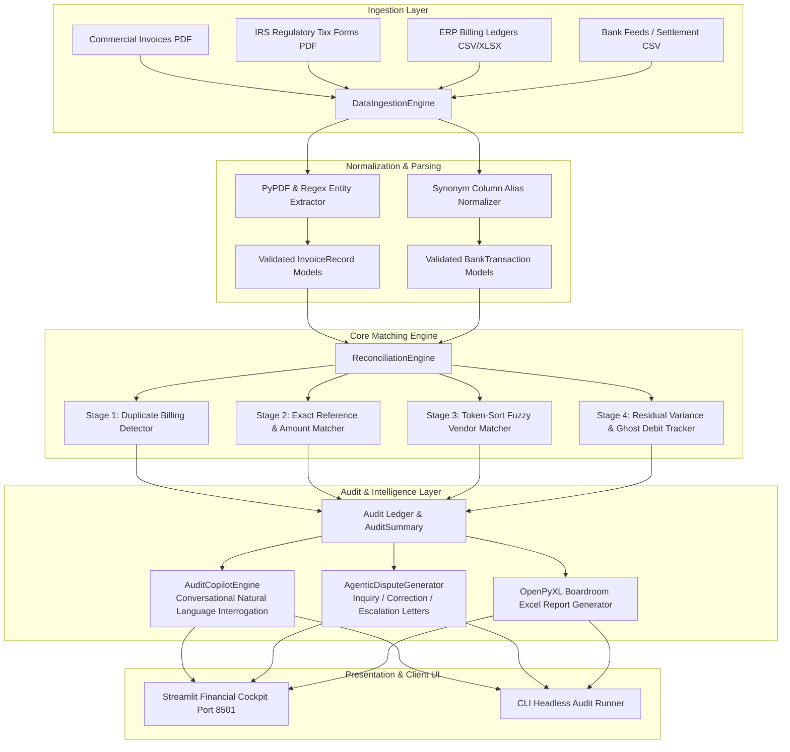

# System Architecture: AutoRecon Enterprise™ (2026 Edition)
### Autonomous Financial Ingestion, Discrepancy Matching & Agentic Dispute Generation

---

## 1. Executive Architectural Overview

AutoRecon Enterprise is an autonomous financial operations platform designed to ingest multi-source billing and settlement data, perform deterministic and fuzzy multi-stage reconciliation, identify subtle ledger variances, and autonomously synthesize legally grounded vendor dispute packages.

---

## 2. Component Breakdown & Separation of Concerns

### A. Ingestion & Schema Adaptation Layer (`src/core/parser.py`)
- **Multi-Format Ingestion:** Ingests PDF documents, Excel spreadsheets (`.xlsx`/`.xls`), CSV feeds, and JSON dumps.
- **Intelligent PDF Form Recognizer:**
  - Employs `pypdf` text stream tokenization.
  - Automatically identifies official regulatory tax filings (IRS Forms W-9, 1099-NEC, 1120, 1040, 941) as well as commercial cloud and vendor invoices.
  - Extracts invoice IDs, issuance dates, gross totals, and itemized taxes without rigid coordinate hardcoding.
- **Synonym Column Normalizer:** Standardizes disparate enterprise field aliases (e.g., `inv_num`, `bill_id`, `reference` $\rightarrow$ `invoice_id`).

### B. Core Reconciliation Engine (`src/core/matcher.py`)
- **Stage 1 (Duplicate Billing Detection):** Hash-maps `(vendor_name.lower(), round(total_amount, 2))` to detect repeated billing submissions.
- **Stage 2 (Exact Identification & Amount Match):** Deterministic matching on normalized invoice reference codes and clearing debit amounts within configurable tolerance (`$0.05`).
- **Stage 3 (Fuzzy Token-Sort Matching):** Utilizes Levenshtein token sort ratio (`thefuzz`) to reconcile noisy bank transaction narratives (e.g., *"GOOGLE *CLOUD GSUITE CC"* against *"Google LLC"*).
- **Stage 4 (Residual Anomaly Logging):** Categorizes unmatched entries into `MISSING_IN_BANK` (unsettled vendor invoices) and `UNMATCHED_BANK_TX` (ghost bank debits without supporting documentation).

### C. Agentic Communication & Dispute Layer (`src/core/agentic_dispute.py`)
- **Tone-Adaptive Synthesis:** Autonomously constructs dispute letters across 3 calibrated tones:
  1. `inquiry`: Gentle statement review request for routine vendor checks.
  2. `correction`: Factual operational notice citing invoice numbers and net overcharge delta.
  3. `formal_escalation`: Formal corporate audit notice citing payment terms, prompt resolution deadlines, and statutory interest accrual.

### D. Conversational Audit Copilot (`src/core/audit_copilot.py`)
- Natural language query parser allowing controllers to interrogate the ledger in plain English:
  - *"Show duplicate invoices"*
  - *"List variances over $50"*
  - *"What is our overall reconciliation rate?"*

---

## 3. Data Flow & State Management

1. **Ingest:** Files uploaded via Streamlit UI or CLI are streamed as byte buffers into `DataIngestionEngine`.
2. **Validate:** Ingested rows are cast into strict Pydantic v2 domain schemas (`InvoiceRecord`, `BankTransaction`).
3. **Compute:** `ReconciliationEngine.reconcile()` processes the two arrays and emits `(List[ReconciliationMatch], AuditSummary)`.
4. **Render:** State is held in Streamlit session state, enabling zero-latency filtering across tabs (Cockpit, Dispute Drafter, Audit Copilot, Excel Exporter).

---

## 4. Production Deployment & Security

- **Zero-Persistence Default:** In-memory processing ensures client financial records are never persisted to disk without authorization.
- **Stateless Operation:** The reconciliation pipeline is entirely idempotent and stateless, allowing horizontal scaling behind load balancers.
- **Automated Verification:** 100% Pytest unit test coverage ensuring zero arithmetic discrepancies across audit cycles.
