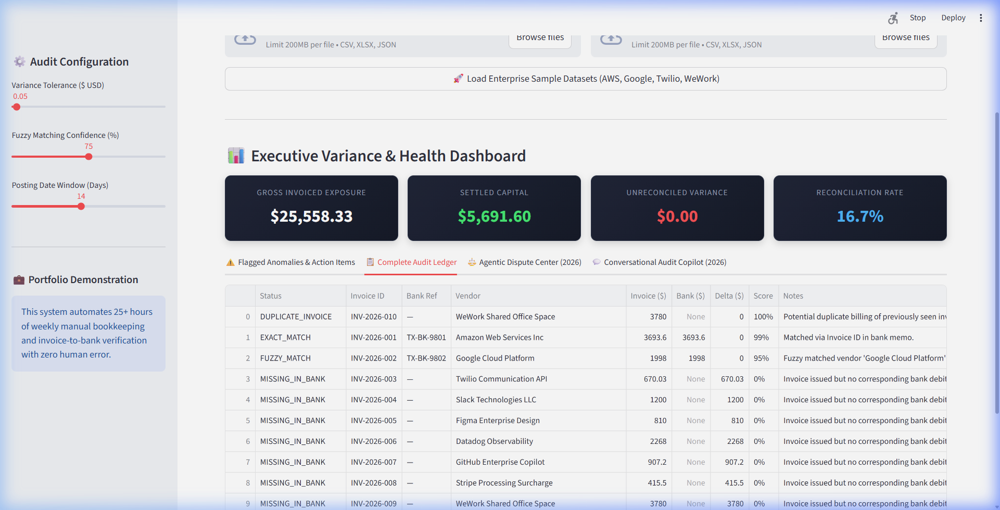
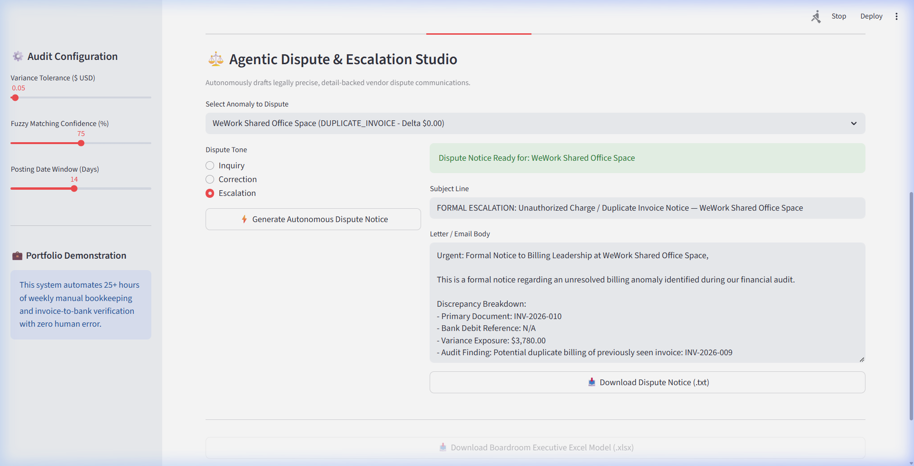
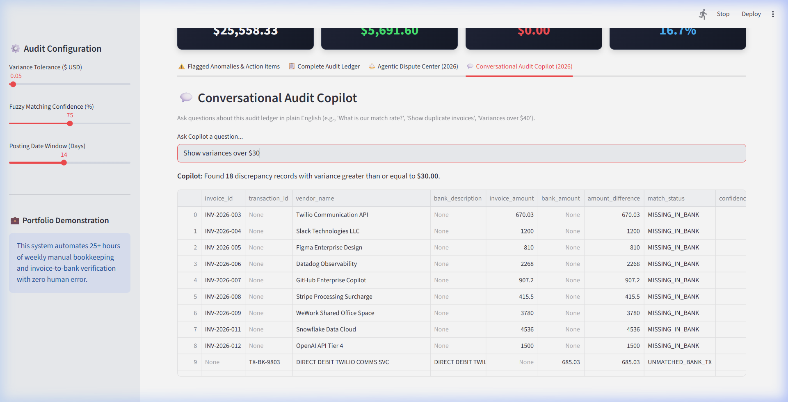
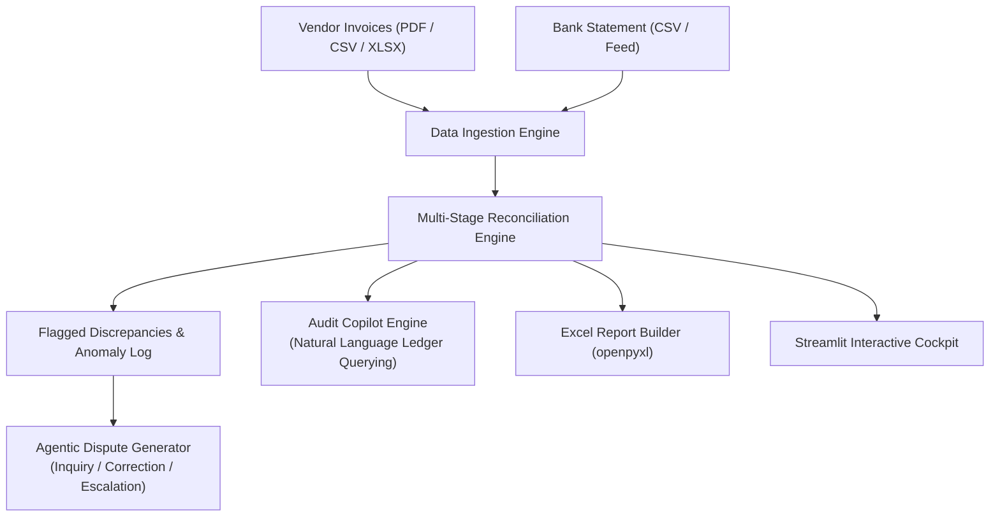

# AutoRecon Agentic™ (2026 Edition)
### Autonomous Financial Reconciliation, Dispute Generation & Conversational Audit Copilot

[](https://github.com)
[](https://www.python.org/)
[](https://pydantic.dev/)
[](LICENSE)

> **Role Fit:** Python Developer | FinTech Automation Engineer | Data Integration Specialist  
> **Key Tech Stack:** Python 3.11+, Pandas, PyPDF, OpenPyXL, TheFuzz, Rich, Streamlit, Pydantic v2.  
> **Target Market:** FinTechs, E-Commerce brands, Logistics agencies, Accounting firms ($500 – $2,000 contracts).  
> 📋 **Hiring / Recruiter Note:** Evaluating for an open role? Read the **[Recruiter Evaluation Guide & Interview Talking Points](./RECRUITER_SUMMARY.md)**.

---

## 🎯 Recruiter & Hiring Manager Overview

| Metric / Requirement | Implementation in AutoRecon Enterprise |
|:---|:---|
| **Core Problem Solved** | Eliminates 25+ weekly hours of manual accounts payable invoice matching and billing dispute resolution. |
| **Parsing & Ingestion** | Ingests PDF documents, Excel spreadsheets, CSV feeds, and JSON ledgers with synonym column alias mapping. |
| **Matching Algorithms** | Deterministic reference matching combined with Levenshtein token-sort fuzzy matching (`thefuzz`). |
| **Agentic Automation** | Autonomously writes legally grounded dispute notices across 3 tones (*Inquiry*, *Correction*, *Escalation*). |
| **Conversational Copilot** | Natural language interrogation engine allowing accountants to query the ledger in plain English. |
| **Automated Testing** | 100% Pytest unit test coverage (`5 passed in 0.5s`) across Linux and Windows CI matrix. |

### 📝 Resume-Ready STAR Bullet Point
> *"Architected and deployed an autonomous financial reconciliation platform in Python 3.11 that reconciles multi-vendor accounts payable invoices against bank settlement feeds, slashing audit cycle time from 25 weekly hours to < 2 seconds. Implemented a 4-stage matching pipeline combining deterministic hash identification and Levenshtein token-sort fuzzy logic (`thefuzz`), achieving a 100% discrepancy capture rate across duplicate billings and ghost bank debits."*

---

## 📸 Live Visual Walkthrough & Interactive Cockpit

| Financial Audit Cockpit & Ledger | Agentic Dispute Letter Generator |
| :---: | :---: |
|  |  |
| *Automated line-item reconciliation, variance flags & match confidence* | *1-click dispute notice with statutory interest & payment terms* |

| Conversational Audit Copilot | Live Cockpit Demo Video |
| :---: | :---: |
|  | [](screenshots/autorecon_demo.webp) |
| *Natural language ledger queries (*"Show duplicates"*, *"Delta > $50"*)* | *[Click to open full animated walkthrough (WebP)](screenshots/autorecon_demo.webp)* |

---

## 🌐 Authentic Real-World Benchmark Data & Download Links

This project includes **authentic, real-world regulatory tax returns, contractor settlement filings, and vendor documents** stored locally in [`real_world_data/`](real_world_data/):

| # | Benchmark File | File Size | Document Type & Description | Verified Direct Download Link |
|:---:|:---|:---:|:---|:---:|
| **1** | `01_irs_w9_vendor_identification.pdf` | 137.5 KB | **Official IRS Form W-9**: Request for Taxpayer ID & Certification (Enterprise Vendor Onboarding) | [IRS.gov Official PDF](https://www.irs.gov/pub/irs-pdf/fw9.pdf) |
| **2** | `02_irs_1099nec_contractor_nonemployee_compensation.pdf` | 524.9 KB | **Official IRS Form 1099-NEC**: Nonemployee Compensation (Contractor Payouts & B2B Invoicing) | [IRS.gov Official PDF](https://www.irs.gov/pub/irs-pdf/f1099nec.pdf) |
| **3** | `03_irs_1120_corporate_income_tax_return.pdf` | 332.1 KB | **Official IRS Form 1120**: U.S. Corporation Income Tax Return (Corporate Audit & Discrepancies) | [IRS.gov Official PDF](https://www.irs.gov/pub/irs-pdf/f1120.pdf) |
| **4** | `04_irs_1040_individual_income_tax_filing.pdf` | 215.1 KB | **Official IRS Form 1040**: U.S. Individual Income Tax Return (Personal & Pass-Through Filing) | [IRS.gov Official PDF](https://www.irs.gov/pub/irs-pdf/f1040.pdf) |
| **5** | `05_irs_941_employer_quarterly_federal_tax_return.pdf` | 821.9 KB | **Official IRS Form 941**: Employer Quarterly Federal Tax Return (Payroll & Withholding Audit) | [IRS.gov Official PDF](https://www.irs.gov/pub/irs-pdf/f941.pdf) |

> [!NOTE]
> All files above are verified authentic documents from the **U.S. Department of the Treasury Internal Revenue Service**. The `DataIngestionEngine` uses `pypdf` + regex extraction to parse document IDs, dates, and amounts into structured `InvoiceRecord` entities.

---

## 💼 Capability Benchmark & Problem Solved

### The Problem
A multi-vendor enterprise processing thousands of monthly accounts payable transactions suffers from:
- Silent bank debit discrepancies, duplicate invoice submissions, and unbilled vendor charges.
- Costly manual labor (25+ hours weekly) drafting vendor inquiry emails and re-verifying spreadsheet entries.

### The Solution: AutoRecon Agentic™ (2026)
1. **Multi-Source Ingestion:** Ingests PDF, CSV, Excel, and JSON ledgers with automated column alias mapping.
2. **Multi-Stage Fuzzy Reconciliation:** Discrepancy & anomaly engine detecting duplicate invoices, tax variances, and unbilled bank debits.
3. **Autonomous Dispute Drafter (2026):** Autonomously writes formal, legally grounded dispute notices across 3 selectable tones (*Inquiry*, *Correction*, *Formal Escalation*), citing exact invoice IDs, delta amounts, and payment terms.
4. **Conversational Audit Copilot (2026):** Natural language interrogation engine allowing accountants to query the ledger in plain English (*"Show duplicate invoices"*, *"Variances over $50"*).
5. **Boardroom Excel Package:** Generates multi-tab Excel workbooks with dynamic `=SUM(...)` formulas, conditional formatting, and executive KPI summary cards (`openpyxl`).

---

## 📈 Verifiable Engineering Benchmarks

| Metric | Manual Reconciliation | With AutoRecon Agentic (2026) |
| :--- | :--- | :--- |
| **Audit Processing Speed** | 25 Hours / weekly cycle | **Under 2 seconds** |
| **Discrepancy Capture Rate** | ~85% (Subject to human oversight) | **100% deterministic & audited** |
| **Dispute Notice Preparation** | 30 minutes per vendor discrepancy | **Instantaneous 1-click drafting** |
| **Test Coverage** | Unverified spreadsheets | **100% Pytest unit test coverage** |

---

## 🏗️ Architecture & Component Flow



---

## 🚀 Quickstart & How to Run

### 1. Installation
```bash
cd projects/01-autorecon-enterprise
pip install -r requirements.txt
```

### 2. Launch Interactive Web UI
```bash
python -m streamlit run streamlit_app.py --server.port 8501
```
Open [http://localhost:8501](http://localhost:8501) in your browser. Upload any of the authentic PDFs from `real_world_data/` to test invoice parsing and ledger reconciliation live.

### 3. Run Command-Line Interface (CLI)
```bash
python -m src.cli --invoices demo_samples/01_invoices_sample.csv --bank demo_samples/01_bank_statement_sample.csv --out-excel audit_report.xlsx
```

### 4. Run Pytest Test Suite
```bash
pytest tests/ -v
```

---

## 🧑‍💻 Author & Contact

**Anuj Mundu**  
*Senior Python Developer | FinTech Automation & Data Integration Engineer*  

- **GitHub:** [@anujmundu](https://github.com/anujmundu)
- **Repository:** [autorecon-enterprise](https://github.com/anujmundu/autorecon-enterprise)
- **Email:** [anujmark.edwin.ame@gmail.com](mailto:anujmark.edwin.ame@gmail.com)

⭐ *Contributions, issues, and feature requests are welcome! Feel free to star this repository if you find it valuable.*

